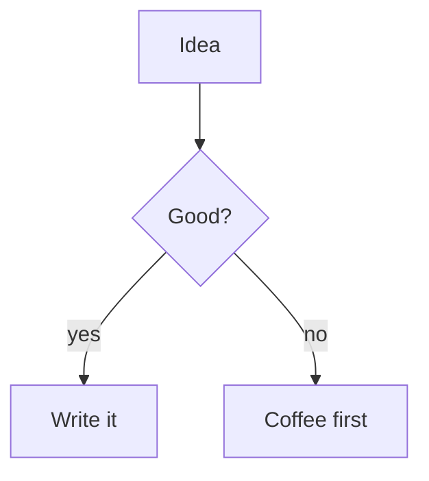

## Turn them on

Both are one toggle away — and off by default to keep the editor light:

1. Open **Settings** (gear icon).
2. Under **Writing tools**, switch on **Math (LaTeX)** and/or **Diagrams (Mermaid)**.

## Write math with KaTeX

- Inline math: wrap it in single dollars — `$e = mc^2$`
- Block math: wrap it in double dollars:

```
$$
\int_0^\infty e^{-x^2} dx = \frac{\sqrt{\pi}}{2}
$$
```

The preview renders it instantly — no internet needed, KaTeX ships inside the app.

## Draw diagrams with Mermaid

Use a fenced code block with the `mermaid` language tag:

````

````

- Flowcharts, sequence diagrams, pie charts, and everything else Mermaid supports.
- Diagrams render in the preview and in HTML exports.

> **Performance tip:** both engines load only when you enable them, so leaving them off keeps startup instant.
